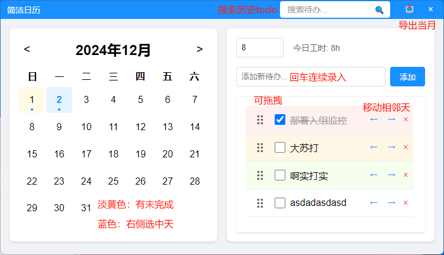

# 简洁日历

> 记录每天Todo，工时



## 功能

- 记录每天Todo，工时
- 上下拖拽Todo
- Todo相邻天移动
- Todo完成，删除
- 导出当月Todo报告
- 搜索历史Todo

## 技术栈

- Electron

## 运行

```bash
npm install
npm run dev
```

## 打包

```bash
# 关闭dev，并用管理员运行打包
npm run build
```
